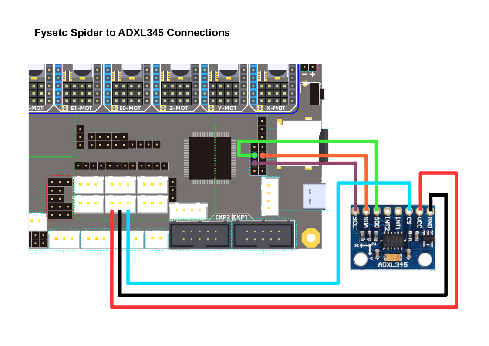

# Fysetc Spider v1.1

## Wiring

!> If you have been testing your Spider without the stepper drivers plugged in, there is a chance that you'll blow the 3.3V voltage regulator on the board if you do not discharge the capacitors before connecting the drivers. The lesson here is don't power up the Spider without the stepper drivers plugged in. Please read https://github.com/FYSETC/FYSETC-SPIDER/blob/main/Spider%203.3v%20issue.md

!> If you use the Ratrig endstop switches and cables, do **not** blindly plug them in to your Spider as doing this will short the board's 3.3V supply rail.  You will probably have to swap the outer two wires (red and white) on the board end of the cable but double check this.

### Connection to your Pi

While the Spider can connect to your Pi via it's UART, a better way of
doing it is via USB as this allows new versions of Klipper to be
uploaded without needing an SDCard.  You can, of course, power the Pi
from your Spider whichever form of connection you use or if you use
a dedicated Pi Power Supply you can shut down your Spider while leaving
the Pi running.

## Firmware installation

For the first time install of Klipper onto the Spider; there are two
methods.  Via SSH(PuTTY)/USB or with an SD Card.  Once klipper is
installed, future updates can be installed over a Pi/Spider USB connection from V-CoreOS using the
~/klipper_config/config/boards/fysetc-spider/make-and-flash-mcu.sh
command and you don't need to fiddle around with jumpers or SDCards.

### via SSH(PuTTY)/USB

Make sure your board is connected to the Pi (USB-C on the Spider, USB-A on the Pi). Connect with SSH (PuTTy for Windows users) to the Pi (login pi, password raspberry if you did not change the defaults).

Fysetc provide instructions on installing Klipper here:
https://github.com/FYSETC/FYSETC-SPIDER#42-Klipper but some
parts of that are less clear than one might wish so here is the sequence
that worked for the author.

Connect a jumper between 3.3V and BT0 on the Spider.

Press the reset button on the Spider.

On the Pi, run the following command:

	lsusb

You should see a device in DFU mode listed. This is your Spider ready to have the firmware
uploaded.

Building the firmware is covered here: https://rat-rig.github.io/V-CoreOS/#/manual-firmware-compilation

Once the firmware is built on the Pi run:

	sudo service klipper stop
	dfu-util -a 0 -s 0x08000000:leave -D ~/klipper/out/klipper.bin

You should see the firmware being written to your Spider.

Now remove the jumper between 3.3V and BT0 on the Spider.  Press the reset button on the Spider.

Run "lsusb" again and you should see a device by the name "OpenMoko, Inc.". This is your Spider running Klipper.

run the command "sudo service klipper start". V-CoreOS should now be able to communicate with your Spider.

### via SD Card

This is documented on the Fysetc pages: https://github.com/FYSETC/FYSETC-SPIDER#42-Klipper

Build the firmare as documented here: https://rat-rig.github.io/V-CoreOS/#/manual-firmware-compilation

Copy the klipper.bin file (~/klipper/out/klipper.bin) to a file named firmware.bin on an SD Card.

Power off your Spider.  Insert the SD Card created above and power the
Spider back on.  The upload should take around 30 seconds and a LED by
the SDCard slot should flash while this is happening.

## Setup

If you're going through initial setup please continue in the [installation guide](installation.md#setup)

## Firmware upgrade

Sometimes klipper makes changes to the microcontroller code and thus your MCU need to be reflashed with new firmware. You can do that in 2 ways.

### SD Card

If you're not used to the command line or haven't used SSH before, the easiest way is to download the new firmware file from the github release page and follow the procedure above for loading the firmware via SD Card. New firmware files will uploaded to the latest release when the klipper firmware changes, this is a manual process though and might not be immediately available. Therefore the recommended method is [flashing via usb](#flashing-via-usb)

### Flashing via USB (Recommended)

The easiest option is to SSH into the pi using something like PuTTy or `ssh pi@v-coreos.local` via the commandline on OS X and Linux machines. Execute `~/klipper_config/config/boards/fysetc-spider/make-and-flash-mcu.sh` and the Pi will compile the klipper firmware and flash the board for you. This has the benefit that it will always recompile the firmware to match your klipper version, so you are not reliant upon the V-CoreOS developers to upload a new firmware binary for you.

!> Be sure to remove the SD card from the board before attempting to flash, if one is in there.

## ADXL Connection

In your printer.cfg add the following:

	#   For ADXL
	[resonance_tester]
	accel_chip: adxl345
	# Change the following to the centre of your bed.
	probe_points: 200,200,20

	[adxl345]
	cs_pin: PA2

Connect the ADXL to the Spider like so:

	Spider         ADXL
	3V3            VCC
	GND            GND
	MISO           SDO
	MOSI           SDA
	SCK            SCL
	PA2            CS

The MISO, MOSI and SCK pins are found on the eight pin block to the left
of the SD Card holder.

PA2 is the right hand pin on the three pin Y+ socket or the right hand pin on the E1 DIAG header.  

GND can be found on the middle pin of the Y+ socket.

3V3 can be picked up from the Y+ socket (left hand pin) but check it's
configured for 3.3 Volts and not 5 (set by solder bridge on the back of
the board).  Alternatively, 3.3 Volts is available on the Z- endstop
socket on next to the BT0 pin.

See the Fysetc wiring plan for details: https://github.com/FYSETC/FYSETC-SPIDER/blob/main/images/Spider_V1.0_Pinout.jpg

## Mini 12864 Display Connection

The Mini 12864 should be connected to the EXP1 & EXP2 ports on the
Spider.  If you have a version 1.0 board then be aware that the ports
were wrongly labeled on the board's silkscreen.  This was corrected on
the V1.1 board.

IDC Sockets?

In your printer.cfg add the following:

	# Support for a 12864 display attached to the Spider
	[display]
	lcd_type: uc1701
	cs_pin: EXP1_3
	a0_pin: EXP1_4
	rst_pin: EXP1_5
	contrast: 63
	encoder_pins: ^EXP2_5, ^EXP2_3
	click_pin: ^!EXP1_2
	menu_reverse_navigation: true
	spi_bus: spi1
	#
	[output_pin beeper]
	pin: EXP1_1
	#
	[neopixel fysetc_mini12864]
	pin: EXP1_6
	chain_count: 3
	color_order: RGB
	initial_RED: 0.0
	initial_GREEN: 1.0
	initial_BLUE: 0.0
	#   Set RGB values on boot up for each Neopixel. 
	#   Index 1 = display, Index 2 and 3 = Knob
	[delayed_gcode setdisplayneopixel]
	initial_duration: 1
	gcode:
		SET_LED LED=fysetc_mini12864 RED=1 GREEN=0 BLUE=0 INDEX=2 TRANSMIT=0
		SET_LED LED=fysetc_mini12864 RED=1 GREEN=0 BLUE=0 INDEX=3 TRANSMIT=0
		SET_LED LED=fysetc_mini12864 RED=0 GREEN=1 BLUE=0 INDEX=1

## Known Problems

### Can't open /dev/fysetc-spider

If V-CoreOS complains that it can't open "/dev/fysetc-spider" run the following command on your Pi:

	sudo ln -s /home/pi/klipper_config/config/boards/fysetc-spider/*.rules /etc/udev/rules.d/

Then disconnect the USB cable, reconnect it and /dev/fysetc-spider should exist. You only need to do this once.

### Undervoltage errors

If you are using the Fysetc TMC2209 step-sticks and performance mode; turn off stealthchop for the X & Y motors to avoid random Undervoltage errors.

Add this to the "### USER OVERRIDES" section of printer.cfg:

	[tmc2209 stepper_x]
	stealthchop_threshold: 0

	[tmc2209 stepper_y]
	stealthchop_threshold: 0

	

